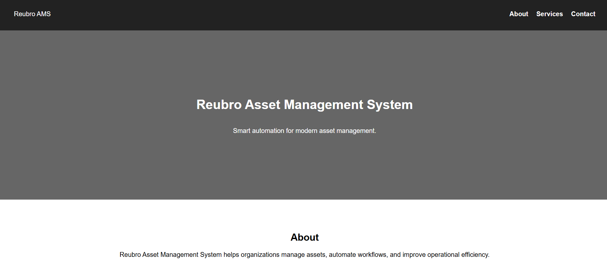
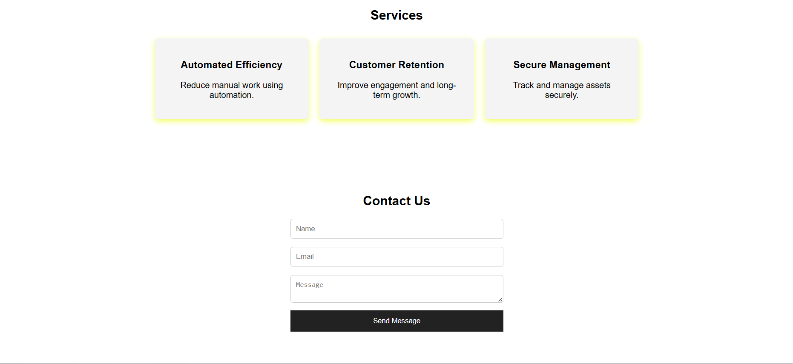

 
# reubro-test-website
this is a sample website done to test github uploading.

# screenshots

# steps to open the project

1.Download the zip file
2.open vs code or any other software
3.run index.html

Or you can directly open index.html file after extracting and open it with any browser.